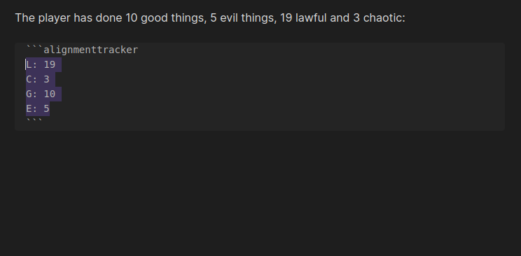
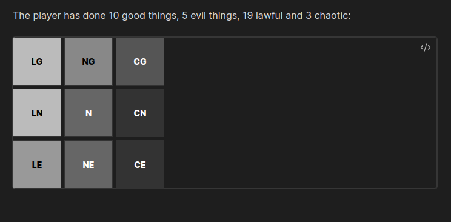

# **Obsidian Alignment Tracker**

I have always found the alignment system in DnD a bit odd. I believe that players' actions should determine their alignment, not the other way around. Some people argue that this makes alignment pointless, but I think this approach provides a better understanding of how players are perceived in the world their characters inhabit. It also restricts access to certain magic items with alignment requirements.

For those who agree with me and use Obsidian, I have a method that has worked so far:

I draw two tables, one with the L-C axis and another with the G-E axis. Every time my players do something that could be seen as Lawful, Chaotic, Neutral, Good, or Evil, I mark a dot in the corresponding cell. From time to time, I review the alignment tables for each player to get a clearer view of their alignment. Sometimes, I even share this with them so they know where they stand.


# Usage
To do this in Obsidian, I developed this plugin. You just need to create an alignmenttracker block and use it. I recommend creating a template with the Templater plugin using the following content:


```
\```alignmenttracker
L: 0
C: 0
G: 0
E: 0
\```
```

Every time they do something that would correspond to `L`, `C`, `G`, or `E` you can increase the relevant number, and the grid will be automatically generated.

# POC

The results are:


